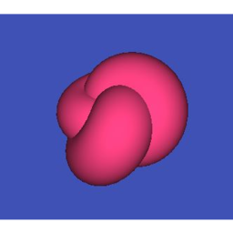

<p align="center"></p>

<h1 align="center">Front-end</h1>

This the front-end application for the [restful API](https://github.com/Web-IV/1920-b1-be-reeveng).

This project is part of the Web Application IV course for the Bachelor of Applied Informatics at the Ghent University College [HoGent](https://www.hogent.be/en/) (Academic year 2019-2020).

---

## Getting Started

### Installation

1. Clone the backend repo and run it

   ```bash
   git clone https://github.com/Web-IV/1920-b1-be-reeveng.git
   ```

2. Clone this repo

   ```bash
   git clone https://github.com/Web-IV/1920-b1-fe-reeveng.git
   ```

3. Open the project root directory

   ```bash
   cd projecten3-1920-angular-kolv02
   ```

4. Install dependencies from npm

   ```bash
   npm install
   ```

5. Run the project

   ```bash
   npm start
   ```

   Your browser should now open `localhost:4200`

> Or copy paste this in your terminal.
>
> ```bash
> git clone https://github.com/HoGent-Projecten3/projecten3-1920-angular-kolv02 && cd projecten3-1920-angular-kolv02 && npm i && npm start
> ```

#### Dummy login

Use the login credentials stated below to test the project's functionality.

- Email: *`govaertr@gmail.com`*
- Password: *`Veilig1@`*

---

- Email: *`VenGov@gmail.com`*
- Password: *`Veilig1@`*

---

- Email: *`Web4@gmail.com`*
- Password: *`Gelukkiggeennetbeans1@`*

## Built With

- [Angular](https://angular.io): Angular is an application design framework and development platform for creating efficient and sophisticated single-page apps.
- [Angular Material](https://material.angular.io): Material Design components for Angular.
- [TypeScript](https://www.typescriptlang.org): TypeScript is a typed superset of JavaScript that compiles to plain JavaScript.
- [ThreeJS](https://threejs.org): JavaScript 3D library.
- [Cypress](https://www.cypress.io): End-to-end testing software.
- [Ngx TypedJS](https://github.com/thevladeffect/ngx-typed-js): An Angular integration for Typed.js. Typed.js is a library that types.
- [Joke API](http://www.official-joke-api.appspot.com): An application program interface that returns jokes.
- [Giphy API](https://developers.giphy.com): An application program interface that returns gifs.

## Screenshots
<p align="center">
    
    
    
    
    
    
</p>

## Created with :heart: by
| <a href="https://github.com/reeveng" target="_blank">**Reeven Govaert**</a> | 
| --- | 
| [](https://github.com/reeveng)|
